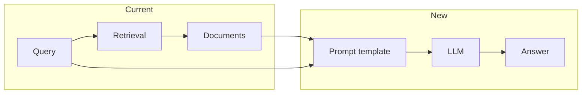

# Add RAG Generator (LangChain-based generation stage)

## Goal

Today RAG-Advanced stops at **retrieval** and **evaluation**: API returns **documents** only ([docs/README_API.md](docs/README_API.md)). There is no **generation** step that turns (query + retrieved documents) into an **answer** string. This plan adds that stage using the [LangChain-style RAG flow](https://www.codecademy.com/article/build-rag-pipelines-in-ai-applications): **prompt template** (context + question) and **LLM** to generate the response.

---

## Current state

- **Retrieval**: [api/routes/strategies.py](api/routes/strategies.py) — `POST /execute`, `POST /chain`, `POST /compare` return **documents** (and metadata). No answer text.
- **LLM usage today**: OpenAI (and optionally Anthropic) are used only inside strategies (query expansion, self-reflective grading/refine in [strategies/agents/query_utils.py](strategies/agents/query_utils.py), [strategies/agents/self_reflective.py](strategies/agents/self_reflective.py)) and in evaluation ([evaluation/datasets.py](evaluation/datasets.py) for LLM-assisted ground truth). No “answer from context” generation.
- **Dependencies**: [pyproject.toml](pyproject.toml) has `openai`, `anthropic`; no `langchain` packages yet.

---

## Design choices

1. **Where generation plugs in**
  - **Primary**: New endpoint `**POST /generate**` that (1) runs retrieval (single strategy or chain, reusing existing executor), (2) runs a LangChain-based “document chain” (stuff documents + query into a prompt, call LLM), (3) returns **answer** plus **documents** and usage/cost. This keeps retrieval unchanged and adds a clear “RAG generate” entry point.
  - **Optional later**: A “generator” step in the chain (e.g. last step returns an answer instead of documents) can be a follow-on; not in initial scope.
2. **LangChain usage**
  - Use LangChain for the **generation** leg only: **prompt template** (context + question) and **LLM** (e.g. `ChatOpenAI`). Retrieval stays as-is (existing strategies + chain executor); we only pass their output (list of [orchestration Document](orchestration/models.py)) into the generator.
  - Pattern (Codecademy): `ChatPromptTemplate` with placeholders `context` and `input` (question); `create_stuff_documents_chain(llm, prompt)` to combine documents and invoke LLM; we invoke with our retrieved docs (converted to LangChain document-like format) and query.
3. **Dependencies**
  - Add: `langchain` (core + chains/prompts), `langchain-openai` (ChatOpenAI). Optional: `langchain-anthropic` if we want to support Claude in the generator. Start with OpenAI to match existing usage and [Codecademy’s optional OpenAI path](https://www.codecademy.com/article/build-rag-pipelines-in-ai-applications).
4. **Cost and config**
  - Reuse [orchestration/cost_tracker.py](orchestration/cost_tracker.py) and [orchestration/pricing.py](orchestration/pricing.py) where possible. LangChain LLM calls can be wrapped or we use callbacks to record token usage and feed the cost tracker so `/generate` response includes cost and tokens (aligned with existing `ExecuteResponse`-style fields).

### Refinements (ApX / production RAG)

Per [ApX: Combining Retrieval and Generation](https://apxml.com/courses/getting-started-rag/chapter-5-building-basic-rag-pipeline/combining-retrieval-generation):

- **Empty retrieval**: When no documents are found, either (1) return a fixed user-facing message (e.g. “I couldn’t find relevant information to answer your query.”) or (2) call the LLM with no context (fallback to standard LLM behavior). Make the chosen behavior explicit in the handler and config (e.g. `no_context_fallback: bool`).
- **Error handling**: Handle retrieval errors and generation errors separately. Return clear, user-facing messages (e.g. “An error occurred during retrieval.” vs “An error occurred while generating the response.”) and appropriate HTTP status where applicable, so clients can distinguish retrieval vs generation failures.
- **Context length**: Optionally check total prompt length (context + query + template) against the model’s context window. If over the limit, truncate context (e.g. drop lowest-ranked documents or trim document text) before calling the LLM, and optionally log or add a response field indicating truncation occurred.

---

## Implementation plan

### 1. Dependencies

**File:** [pyproject.toml](pyproject.toml)

- Add to `dependencies`: `langchain>=0.3.0`, `langchain-openai>=0.2.0` (or current stable). Optionally `langchain-anthropic` for Claude later.
- Ensure version ranges are compatible with existing `openai>=1.60.0` and Python 3.10+.

### 2. Generator module (LangChain document chain)

**New:** `generation/` package (or under `orchestration/` or `api/` — recommend `**generation/**` at repo root to keep “retrieval” and “generation” as separate stages).

- `**generation/__init__.py**` — export public API (e.g. `generate_answer`, `BuildGeneratorConfig`).
- `**generation/chain.py**` (or `generation/generator.py`):
  - **Build a “stuff documents” chain** using LangChain:
    - `ChatPromptTemplate.from_template(...)` with placeholders for `context` and `input` (question), e.g. “Answer the question based only on the following context:\n\n{context}\n\nQuestion: {input}”.
    - `create_stuff_documents_chain(llm, prompt)` where `llm` is a LangChain chat model (e.g. `ChatOpenAI(model=..., temperature=...)`). Use env or config for model name (e.g. `GENERATION_MODEL` or reuse existing pricing config).
    - Input: list of document contents (or LangChain `Document` with `page_content`); we can convert from our `orchestration.models.Document` by mapping `.content` (and optionally id/title for source listing).
  - `**generate_answer(query: str, documents: list[Document], *, model: str | None = None, prompt_template: str | None = None) -> tuple[str, int, int, float]**` (or a small result dataclass: answer, input_tokens, output_tokens, cost_usd):
    - Convert our `Document` list to format expected by the chain (e.g. list of LangChain Documents or a single “context” string).
    - Invoke the chain with query and context.
    - Track tokens (from LLM response or callbacks) and compute cost via existing pricing provider; return answer + usage + cost.
  - **Config**: Default prompt template and default model (e.g. `gpt-4o-mini`) in code or in [config/](config/) (e.g. `config/generation.yaml` or entries in existing config). Allow override via function arguments so the API can pass optional `model` and `prompt_template`.
  - **Context length** (optional): Before invoking the chain, check total prompt size vs model context window; if over limit, truncate context (e.g. drop or shorten lowest-ranked documents) and optionally set a `context_truncated` flag in the result.
- **Optional**: LangChain callbacks to push token counts into the app’s cost tracker so generation cost is consistent with the rest of the app.

### 3. API endpoint `POST /generate`

**File:** [api/routes/](api/routes/) — new `generate.py` or add to an existing route file.

- **Request body** (Pydantic): `query` (required), optional `strategy` (default e.g. `"standard"`) or `steps` for a chain (if we support chain-based retrieval for generate), optional `limit`, `model`, `prompt_template`. Keep first version simple: single strategy + limit; chain can be added as an option.
- **Handler**:
  1. Run retrieval: call existing `execute_strategy_endpoint` logic or `StrategyExecutor().execute(strategy, query, config)` to get `ExecutionResult` (list of documents). On retrieval exception, return a clear user-facing message and appropriate status (e.g. 502 or 503).
  2. **Empty retrieval**: If documents are empty, either return 200 with a fixed `answer` (e.g. “I couldn’t find relevant information…”) or call the LLM with no context per config (`no_context_fallback`); make behavior explicit.
  3. Call `generation.chain.generate_answer(query, result.documents, ...)`. On generation exception, return a clear user-facing message (e.g. “An error occurred while generating the response.”) and appropriate status.
  4. Return JSON: `answer`, `documents` (or `sources`), `model`, `input_tokens`, `output_tokens`, `cost_usd`, and optionally `retrieval_latency_ms`, `generation_latency_ms`.
- **Auth**: Same as other endpoints (e.g. API key via existing middleware).
- **OpenAPI**: Document request/response and add an example in the schema (and in [docs/README_API.md](docs/README_API.md)).

### 4. Wiring and config

- **App startup**: No need to register a LangChain retriever; we only need the LLM and chain. The generator can build the chain lazily or at first request to avoid loading heavy deps at startup.
- **Environment**: Document `OPENAI_API_KEY` (already required for other features). Optional `GENERATION_MODEL` (default `gpt-4o-mini`) and, if we support it, `GENERATION_PROMPT_TEMPLATE` or path to a template file.
- **Pricing**: Ensure the generation model is present in [config/pricing.json](config/pricing.json) (or equivalent) so cost calculation works; add entry if missing.

### 5. Documentation

- **README / docs**: Add a short “RAG pipeline: retrieval + generation” section describing the three stages (ingestion, retrieval, generation), and that **generation** is available via `POST /generate`. Update [docs/README_API.md](docs/README_API.md) with the new endpoint, request body, and response shape.
- **References**: In the doc, reference the [Codecademy RAG pipeline article](https://www.codecademy.com/article/build-rag-pipelines-in-ai-applications) (prompt template + LLM; we use LangChain’s `create_stuff_documents_chain` and ChatOpenAI) and [ApX: Combining Retrieval and Generation](https://apxml.com/courses/getting-started-rag/chapter-5-building-basic-rag-pipeline/combining-retrieval-generation) (augmented prompt, empty-context handling, error handling, context length).

### 6. Tests

- **Unit**: Test `generate_answer()` with a mock LLM (patch LangChain’s invoke or the OpenAI client) and a fixed list of documents; assert that the returned answer and token/cost fields are set and that the prompt template is applied (context contains document contents, query is in the prompt).
- **Integration** (optional): Call `POST /generate` with a test query and a pre-seeded DB or mock retrieval; assert 200 and that `answer` is non-empty when documents are provided.

---

## Summary

| Area             | Action                                                                                                                                                             |
| ---------------- | ------------------------------------------------------------------------------------------------------------------------------------------------------------------ |
| **Dependencies** | Add `langchain`, `langchain-openai` in pyproject.toml.                                                                                                             |
| **Generator**    | New `generation/` package: build LangChain stuff-documents chain (prompt + ChatOpenAI), `generate_answer(query, documents, ...)` returning answer + tokens + cost. |
| **API**          | New `POST /generate`: run retrieval (single strategy), then `generate_answer()`, return `answer`, `documents`, `model`, tokens, cost.                              |
| **Config**       | Default model and prompt template; optional env/config overrides; ensure pricing entry for generation model.                                                       |
| **Docs**         | Document retrieval + generation flow and new endpoint in README_API and a short pipeline overview.                                                                 |
| **Tests**        | Unit test for `generate_answer` with mocked LLM; optional integration test for `/generate`.                                                                        |

This adds a true “generator” stage so the RAG pipeline goes from retrieval-only to retrieval + generation, using the LangChain framework as in the Codecademy article, while reusing existing retrieval and cost infrastructure.