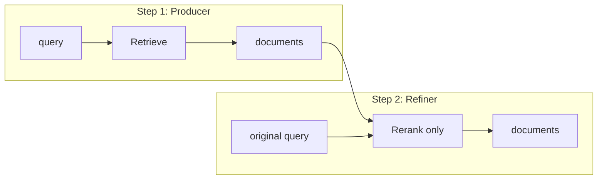

# Real chaining: output-as-input between strategies

## Goal

Make the chain a **modular relay**: each step’s output becomes the next step’s input (documents and optionally query). This enables:

- **Progressive refinement**: e.g. broad retrieval (multi_query) → rerank to top-K.
- **Clear separation of roles**: retrieval vs. refinement; errors in one step don’t corrupt the next.
- **Align with article pipeline**: expand query → initial retrieval (high recall) → rerank with **original** query (precision).

---

## Strategy roles and sensible sequences

From the codebase and the [article](https://markaicode.com/advanced-rag-techniques-reranking-query-expansion/):

| Role                      | Strategies                                                       | Input                                              | Output          |
| ------------------------- | ---------------------------------------------------------------- | -------------------------------------------------- | --------------- |
| **Retrieval (producer)**  | standard, multi_query, query_expansion, self_reflective, agentic | query (and optional refined query from prior step) | documents       |
| **Refinement (consumer)** | reranking                                                        | query + **input documents** (from previous step)   | reranked subset |

**Sensible sequences (with document passing):**

1. **standard → reranking**
  Step 1: vector search (e.g. `limit=20`). Step 2: rerank those 20 with cross-encoder to `final_k=5`. No second retrieval.
2. **multi_query → reranking**
  Step 1: expand query, parallel retrieval, dedupe (e.g. 20 docs). Step 2: rerank those 20 to 5. Matches article “expand → retrieve → rerank.”
3. **query_expansion → reranking**
  Step 1: one expanded query + retrieval. Step 2: rerank those docs with original query.

Other strategies (self_reflective, agentic) remain **producers only** for this phase: they ignore `input_documents` and do their own retrieval; they can be first (or later) steps. Only **reranking** needs a “refine-only” mode when it receives documents from the previous step.

---

## Current vs desired behavior

- **Today**: [ChainContext](orchestration/models.py) stores only step **metadata** (counts, ids) in `intermediate_results`; [ExecutionContext](orchestration/executor.py) has no `input_documents`. [Chain executor](orchestration/chain_executor.py) calls `execute(strategy, context.query, config)` every time; no documents are passed, so the final result is just the last step’s own retrieval.
- **Desired**: ChainContext carries the **last step’s documents**; ExecutionContext (and the executor) accept optional **input_documents** and **original_query**. When a step has input documents, strategies that support it (reranking) use them instead of doing retrieval; others ignore input_documents and behave as today.

---

## Implementation plan

### 1. ChainContext: carry documents for the next step

**File:** [orchestration/models.py](orchestration/models.py)

- Add to `ChainContext` an immutable field for “documents to pass to the next step”:
  - `input_documents: tuple[Document, ...] = ()`  
  (Use tuple for immutability; `Document` is already used in `ExecutionResult`.)
- Update `with_step_result(self, result: ExecutionResult)` so that the **new** context has:
  - `input_documents = tuple(result.documents)` (so the **next** step receives this step’s output),
  - and keep existing updates (e.g. `intermediate_results`, `total_cost`, etc.).
- No change to `with_query`; it can be used later for query refinement if a step returns a refined query in metadata.

This way, after step 1 runs, the context for step 2 already has `input_documents` set to step 1’s documents.

### 2. ExecutionContext and executor: accept input_documents and original_query

**File:** [orchestration/executor.py](orchestration/executor.py)

- Extend **ExecutionContext** with:
  - `input_documents: list[Document] | None = None` — when set, strategies that support it (e.g. reranking) use these as the candidate set instead of retrieving.
  - `original_query: str | None = None` — when set (e.g. in a chain), reranking uses this for scoring (article: “Use original query for re-ranking”).
- Extend **StrategyExecutor.execute()** with optional kwargs:
  - `input_documents: list[Document] | None = None`
  - `original_query: str | None = None`
- When building `ExecutionContext` for `execute()`, pass these through from the caller (chain executor).

Single-step calls (API `POST /execute`, benchmarks) leave both `None`; behavior stays unchanged.

### 3. Chain executor: pass documents and original_query into each step

**File:** [orchestration/chain_executor.py](orchestration/chain_executor.py)

- When calling `_executor.execute()` for step `i`:
  - Pass `query=context.query` (current query; may be refined in a future iteration).
  - If `context.input_documents` is non-empty, pass `input_documents=list(context.input_documents)`.
  - Always pass `original_query=context.original_query` (set once at chain start) so reranking can use the user’s original query when reranking passed documents.
- After each step, update context with `context = context.with_step_result(step_result.result)` so the next step sees this step’s documents in `context.input_documents`.

No change to fallback, `continue_on_error`, or error handling; step boundaries and error isolation remain as they are.

### 4. Reranking strategy: “rerank-only” mode

**File:** [strategies/agents/reranking.py](strategies/agents/reranking.py)

- At the start of `_reranking_search_impl` (or the strategy function that builds `ExecutionContext`), check for `ctx.input_documents` (from ExecutionContext).
- **If `ctx.input_documents` is present and non-empty:**
  - **Skip** Stage 1 (vector search / DB call).
  - Use `ctx.input_documents` as the candidate list.
  - Use `ctx.original_query` if set, else `ctx.query`, for the cross-encoder (so reranking is by original user query when in a chain).
  - Run Stage 2 only: cross-encoder on `(query, doc.content)` pairs, sort by score, return top `final_k` documents. Map existing `Document` objects to the format expected by the cross-encoder (content, id, etc.).
- **If `ctx.input_documents` is None or empty:** keep current behavior: Stage 1 (vector search with `initial_k`) + Stage 2 (rerank to `final_k`).

This preserves backward compatibility: single-step reranking and non-chain use are unchanged; chain use gains document passing.

### 5. Other strategies: ignore input_documents

**Files:** [strategies/agents/standard.py](strategies/agents/standard.py), [strategies/agents/multi_query.py](strategies/agents/multi_query.py), [strategies/agents/query_expansion.py](strategies/agents/query_expansion.py), and any other retrieval-only strategies.

- They do **not** read `ExecutionContext.input_documents`. They only use `query` and `config` and perform their own retrieval.
- So when they are step 2 in a chain, they currently “re-retrieve” (same as today). To get true relay behavior, users should put **reranking** (or another future refiner) as the step that receives the previous step’s documents. No code change required in these strategies for the minimal “standard/multi_query → reranking” flow.

### 6. API and docs

- **API:** No change to request shape. `POST /chain` already sends `steps` and `query`. Document passing is internal; the chain executor will pass `context.input_documents` and `context.original_query` when calling the executor.
- **Docs:** Update [docs/README_orchestration.md](docs/README_orchestration.md) (and any chain-related section in [docs/README_API.md](docs/README_API.md) if present) to:
  - State that chaining **now** passes each step’s output (documents) as the next step’s input.
  - Explain which sequences make sense: e.g. **multi_query → reranking**, **standard → reranking** (retrieval step then rerank-only step).
  - Note that reranking, when it receives input documents from the previous step, skips its own retrieval and only reranks (using original query when in a chain).
  - Keep the existing note that `include_step_documents: true` shows per-step results; final `documents` are still the last step’s output, which now reflects the full pipeline (e.g. expanded retrieval then reranked subset).

### 7. Tests

- **Unit:**
  - Reranking: test that when `ExecutionContext` has `input_documents` (and optionally `original_query`), the strategy does not call the DB and returns a reranked subset of `input_documents` of size `final_k`.
  - ChainContext: test that `with_step_result(result)` produces a new context whose `input_documents` equals `result.documents`.
- **Integration / chain:**
  - Chain [standard, reranking] with e.g. standard `limit=10`, reranking `final_k=3`: assert final document count is 3 and that the reranking step did not perform its own retrieval (e.g. mock or assert no extra DB call in rerank step).
  - Chain [multi_query, reranking]: same idea; final list is reranked subset of multi_query’s output.

---

## Optional / future (out of scope for this plan)

- **Query refinement:** A step could return a refined query (e.g. in metadata); chain executor could call `context.with_query(refined_query)` before the next step. ChainContext already supports `with_query`; only strategy contract and executor wiring would need to be defined.
- **Explicit “use_previous_documents” per step:** Could add a flag on `ChainStep` (e.g. `use_previous_documents: bool`) so that only steps that opt in receive `input_documents`; default `True` for backward compatibility with the new behavior, or `False` to preserve “no passing” for specific steps. Can be added later if needed.
- **Other refiners:** Any future strategy that “filters” or “reranks” could similarly check `ctx.input_documents` and run in refine-only mode.

---

## Summary

| Area                            | Change                                                                                          |
| ------------------------------- | ----------------------------------------------------------------------------------------------- |
| **ChainContext**                | Add `input_documents`; `with_step_result()` sets it to last step’s documents for the next step. |
| **ExecutionContext / Executor** | Add `input_documents` and `original_query`; pass through from chain.                            |
| **Chain executor**              | Pass `context.input_documents` and `context.original_query` into `execute()` each step.         |
| **Reranking**                   | When `input_documents` present, skip retrieval; rerank only, using `original_query` when set.   |
| **Other strategies**            | No change; ignore `input_documents`.                                                            |
| **Docs**                        | Describe real chaining, sensible sequences, and rerank-only behavior.                           |
| **Tests**                       | Unit (rerank-only, ChainContext); integration (standard→reranking, multi_query→reranking).      |

This yields real chaining (output-as-input), keeps error isolation and modular steps, and aligns with the article’s expand → retrieve → rerank pipeline.